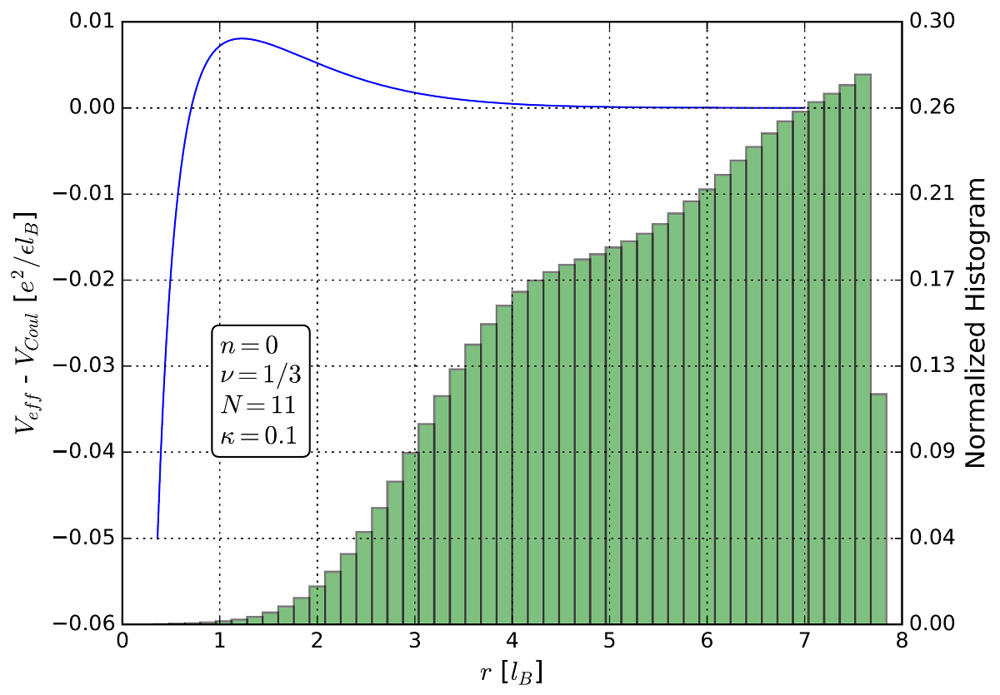

    

<h1 align="center">
  A Systematic Method for Constructing Realistic Potentials in Real Space for Use in Fractional Quantum Hall Monte Carlo Simulations
</h1>

A thesis
presented to the Department of Physics & Astronomy at
California State University, Long Beach
in partial fulfillment
of the requirements for the degree
Master of Science in Physics. Committee Members:
Michael R. Peterson, Ph.D. (Chair),
Andreas Bill, Ph.D., and
Jiyeong Gu, Ph.D. [View publication](https://www.proquest.com/docview/2779955260)

## Abstract

We develop a method for efficiently generating real space potentials which incorporate
realistic effects into Monte Carlo calculations of fractional quantum Hall energy gaps. We
apply the method to the effect Landau level mixing, which creates a discrepancy between
experimental measurements and theoretical predictions in graphene. We fit perturbative,
two-body, Landau level mixing-incorporated Haldane pseudopotential corrections to data
in the lowest Landau level. We develop an effective real space potential Veff(r, κ, Q) which
maps to corrected pseudopotentials on the Haldane sphere for Landau level mixing parameter
κ and magnetic monopole strength Q. We use this effective potential to calculate
Landau level mixing-incorporated energy gaps for fractional quantum Hall states of
graphene via the Metropolis-Hastings Monte Carlo algorithm and benchmark the results
against exact diagonalization. We find that the Metropolis Hastings algorithm does not
sample the more dense electron configurations most affected by Landau level mixing and
suggest further study developing an algorithm that will sample them.

## Version

1.0.0

## Author

Paul Fischer

- Email: paulfischerdev@gmail.com
- Twitter: [@PaulFis43236408](https://twitter.com/PaulFis43236408)
- GitHub: [pfischer1687](https://github.com/pfischer1687)
- Website: [https://paulfischer.dev/](https://paulfischer.dev/)

## Dependencies

- `pdfTeX@3.14159265-2.6-1.40.21`
- `python@3.7.13`
- `jupyter-notebook@6.0.3`
- `pandas@1.0.4`
- `numpy@1.19.0`
- `IPython@7.14.0`
- `matplotlib@3.1.2`
- `scipy@1.4.1`
- `sympy@1.6`

## Keywords

- Fractional Quantum Hall Effect
- Markov Chain
- Monte Carlo
- Energy Gap
- Landau Level Mixing
- Graphene
- Haldane Pseudopotential
- Metropolis-Hastings Algorithm
- Exact Diagonalization

## License

Unlicensed

## Repository

git: [https://github.com/pfischer1687/ms-thesis](https://github.com/pfischer1687/ms-thesis)

## Bugs

[https://github.com/pfischer1687/ms-thesis](https://github.com/pfischer1687/ms-thesis)
